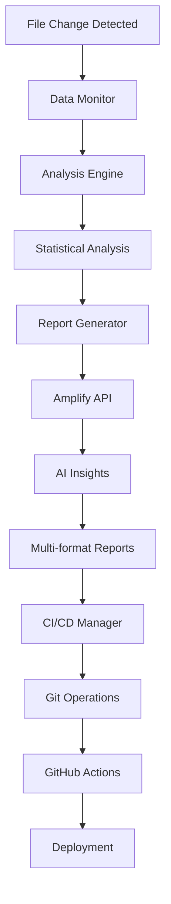

# Complete Data Analysis Pipeline Guide
## Comprehensive Code Explanation and Setup Instructions

---

# Table of Contents

1. [Project Overview](#project-overview)
2. [Architecture and Design](#architecture-and-design)
3. [File-by-File Code Explanations](#file-by-file-code-explanations)
4. [Complete Setup Instructions](#complete-setup-instructions)
5. [Usage Examples](#usage-examples)
6. [Troubleshooting](#troubleshooting)
7. [Advanced Topics](#advanced-topics)

---

# Project Overview

## What We Built

The **Data Analysis Pipeline with CI/CD Integration** is a comprehensive, production-ready system that automates the entire data analysis workflow from file monitoring to report deployment. This system represents a complete integration of modern data science practices with DevOps automation.

### Core Capabilities

1. **🔍 Real-time Data Monitoring**
   - Automatic detection of new/modified data files
   - Support for CSV, JSON, Excel, and Parquet formats
   - Configurable file size limits and type filters

2. **📊 Comprehensive Statistical Analysis**
   - Descriptive statistics (mean, median, std dev, skewness, kurtosis)
   - Data quality assessment (missing values, duplicates, completeness)
   - Correlation analysis (Pearson and Spearman)
   - Distribution analysis with normality testing
   - Outlier detection (IQR and Z-score methods)
   - Hypothesis testing (t-tests, Mann-Whitney U)
   - Time series analysis and trend detection

3. **🤖 AI-Powered Insights**
   - Integration with Amplify API for intelligent analysis
   - Business-focused recommendations
   - Data quality assessment and suggestions
   - Automated insight generation

4. **📋 Multi-Format Reporting**
   - Professional HTML reports with visualizations
   - JSON reports for programmatic access
   - Text summaries for quick review
   - Interactive charts and graphs

5. **🚀 Complete CI/CD Integration**
   - Automated Git workflows with branch creation
   - Intelligent commit messages and PR descriptions
   - GitHub Actions for validation and deployment
   - Pipeline history and monitoring

### System Architecture

```
┌─────────────────────────────────────────────────────────────────┐
│                    Data Analysis Pipeline                        │
├─────────────────────────────────────────────────────────────────┤
│                                                                 │
│  ┌─────────────┐    ┌──────────────┐    ┌─────────────────┐     │
│  │ Data Files  │───▶│ Data Monitor │───▶│ Analysis Engine │     │
│  │(.csv, .json,│    │(Watchdog FS) │    │(Stats + ML)     │     │
│  │ .xlsx, .pqt)│    └──────────────┘    └─────────────────┘     │
│  └─────────────┘                                  │            │
│                                                   ▼            │
│  ┌─────────────┐    ┌──────────────┐    ┌─────────────────┐     │
│  │GitHub Actions│◀───│ CI/CD Manager│◀───│Report Generator │     │
│  │(Validation &│    │(Git Ops)     │    │(Amplify API +   │     │
│  │ Deployment) │    └──────────────┘    │ Multi-format)   │     │
│  └─────────────┘                        └─────────────────┘     │
└─────────────────────────────────────────────────────────────────┘
```

---

# Architecture and Design

## Design Principles

### 1. **Asynchronous Processing**
- All I/O operations are non-blocking
- Concurrent analysis of multiple files
- Responsive system that doesn't freeze

### 2. **Modular Architecture**
- Each component has a single responsibility
- Easy to test, modify, and extend
- Clear separation of concerns

### 3. **Configuration-Driven**
- Environment variables for all settings
- No hardcoded values
- Easy deployment across environments

### 4. **Error Resilience**
- Graceful handling of failures
- Comprehensive logging
- Fallback options for missing dependencies

### 5. **Professional Reporting**
- Multiple output formats
- Interactive visualizations
- Executive summaries for stakeholders

## Component Interaction Flow



---

# File-by-File Code Explanations

## 1. main.py - Pipeline Orchestrator

### Purpose
The entry point that coordinates all system components and provides both continuous monitoring and on-demand analysis capabilities.

### Key Classes and Methods

#### `DataAnalysisPipeline` Class
The main orchestrator that manages the entire pipeline lifecycle.

```python
class DataAnalysisPipeline:
    """Main pipeline orchestrator."""
    
    def __init__(self):
        self.config = config                    # Global configuration
        self.monitor: Optional[DataMonitor] = None      # File monitoring
        self.analysis_engine: Optional[AnalysisEngine] = None  # Statistical analysis
        self.report_generator: Optional[ReportGenerator] = None # Report generation
        self.cicd_manager: Optional[CICDManager] = None        # Git automation
        self.running = False                    # Pipeline state
```

#### Core Methods Explained

**`initialize()` Method**
- Validates configuration before starting
- Creates instances of all pipeline components
- Sets up file monitoring with callback
- Returns boolean indicating success/failure

**`on_data_change()` Method**
- Triggered when files are created/modified
- Orchestrates the analysis workflow:
  1. Run statistical analysis
  2. Generate AI-powered reports
  3. Trigger CI/CD automation
- Comprehensive error handling at each step

**`start()` Method**
- Initializes the entire pipeline
- Starts file monitoring
- Keeps pipeline running with async sleep loop
- Handles graceful shutdown

### Usage Patterns

```python
# Continuous monitoring
python main.py

# Single file analysis
python main.py --analyze data/sample.csv

# Help information
python main.py --help
```

### Key Design Features
- **Signal handling** for graceful shutdown (SIGINT, SIGTERM)
- **Async/await pattern** for non-blocking operations
- **Error isolation** - component failures don't crash the system
- **Logging integration** throughout the pipeline

---

## 2. config.py - Configuration Management

### Purpose
Centralized configuration management using environment variables with sensible defaults and validation.

### Key Features

#### `Config` Class
Manages all application settings through properties with automatic validation.

```python
class Config:
    """Configuration management for the data analysis pipeline."""
    
    def __init__(self):
        self.setup_logging()  # Configure logging on initialization
```

#### Configuration Categories

**API Configuration**
```python
@property
def amplify_api_key(self) -> str:
    """Get Amplify API key from environment variables."""
    api_key = os.getenv('AMPLIFY_API_KEY')
    if not api_key:
        raise ValueError("AMPLIFY_API_KEY environment variable not set")
    return api_key
```
- Validates required API key
- Provides base URL with default fallback
- Raises clear errors for missing critical config

**Directory Configuration**
- Data directory for monitoring (default: `./data`)
- Output directory for reports (default: `./output`)
- Automatic directory creation

**Analysis Parameters**
```python
@property
def analysis_config(self) -> Dict[str, Any]:
    """Configuration for statistical analysis."""
    return {
        'confidence_level': float(os.getenv('CONFIDENCE_LEVEL', '0.95')),
        'max_file_size_mb': int(os.getenv('MAX_FILE_SIZE_MB', '100')),
        'sample_size_threshold': int(os.getenv('SAMPLE_SIZE_THRESHOLD', '1000')),
        'correlation_threshold': float(os.getenv('CORRELATION_THRESHOLD', '0.5'))
    }
```

**Logging Setup**
- Dual output: file and console
- Configurable log levels
- Automatic log directory creation

### Configuration Philosophy
- **Security**: No hardcoded secrets
- **Flexibility**: Environment variable overrides
- **Reliability**: Validation and sensible defaults
- **Maintainability**: Centralized management

---

## 3. data_monitor.py - File System Monitoring

### Purpose
Real-time file system monitoring using the watchdog library to detect data file changes and trigger analysis.

### Key Components

#### `DataFileHandler` Class
Extends `FileSystemEventHandler` to process file system events.

```python
class DataFileHandler(FileSystemEventHandler):
    """Handler for data file system events."""
    
    def __init__(self, callback: Callable[[str], Awaitable[None]]):
        super().__init__()
        self.callback = callback  # Analysis pipeline callback
        self.supported_extensions = config.supported_file_types
        self.processing_files: Set[str] = set()  # Prevent duplicates
```

#### File Processing Logic

**Validation Chain**
1. **File type check**: Must be supported extension
2. **Size validation**: Must be within configured limits
3. **Duplicate prevention**: Skip if already processing
4. **Access verification**: Ensure file is readable

**Event Handling**
- `on_modified()`: Handles file modification events
- `on_created()`: Handles file creation events
- Both forward to common `_handle_file_change()` method

#### `DataMonitor` Class
Main monitoring coordinator that manages the watchdog observer.

```python
class DataMonitor:
    """Main data monitoring class."""
    
    async def start(self) -> None:
        """Start monitoring the data directory."""
        # Create directory if needed
        self.watch_directory.mkdir(parents=True, exist_ok=True)
        
        # Set up event handler and observer
        self.handler = DataFileHandler(self.callback)
        self.observer = Observer()
        self.observer.schedule(self.handler, str(self.watch_directory), recursive=True)
        
        # Start monitoring and process existing files
        self.observer.start()
        await self._process_existing_files()
```

### Advanced Features
- **Recursive monitoring**: Watches subdirectories
- **Existing file processing**: Analyzes files present at startup
- **Delayed processing**: Prevents system overload
- **Status reporting**: Provides monitoring statistics
- **Manual triggering**: For testing and one-off analysis

---

## 4. analysis_engine.py - Statistical Analysis

### Purpose
Comprehensive statistical analysis engine that performs descriptive statistics, correlation analysis, distribution testing, outlier detection, and hypothesis testing.

### Core Analysis Components

#### `AnalysisEngine` Class
Main analysis coordinator that orchestrates all statistical computations.

```python
class AnalysisEngine:
    """Main statistical analysis engine."""
    
    async def analyze_file(self, file_path: str) -> Optional[Dict[str, Any]]:
        """Analyze a data file and return comprehensive results."""
        # Load data from multiple formats
        data = await self._load_data(file_path)
        
        # Perform comprehensive analysis
        analysis_results = {
            'file_info': self._get_file_info(file_path, data),
            'data_quality': await self._assess_data_quality(data),
            'descriptive_stats': await self._descriptive_analysis(data),
            'correlation_analysis': await self._correlation_analysis(data),
            'distribution_analysis': await self._distribution_analysis(data),
            'outlier_detection': await self._detect_outliers(data),
            'hypothesis_tests': await self._hypothesis_testing(data),
            'time_series_analysis': await self._time_series_analysis(data),
            'visualizations': await self._generate_visualizations(data, file_path)
        }
        
        return analysis_results
```

#### Analysis Categories

**1. Data Quality Assessment**
- Missing value analysis by column
- Duplicate record detection
- Data completeness metrics
- Column-specific quality scores

**2. Descriptive Statistics**
- Basic statistics (mean, median, std dev, quartiles)
- Advanced metrics (skewness, kurtosis, coefficient of variation)
- Categorical analysis with entropy calculations

**3. Correlation Analysis**
```python
# Pearson and Spearman correlation matrices
pearson_corr = numeric_data.corr(method='pearson')
spearman_corr = numeric_data.corr(method='spearman')

# Strong correlation identification
threshold = self.config.analysis_config['correlation_threshold']
# Find correlations above threshold with significance classification
```

**4. Distribution Analysis**
- Normality testing (Shapiro-Wilk, Kolmogorov-Smirnov)
- Distribution classification (normal-like, skewed, peaked, flat)
- Statistical shape analysis

**5. Outlier Detection**
- IQR method (1.5 × IQR rule)
- Z-score method (|z| > 3)
- Percentage and count reporting

**6. Hypothesis Testing**
- One-sample t-tests (mean ≠ 0)
- Independent t-tests between variables
- Non-parametric Mann-Whitney U tests

**7. Time Series Analysis**
- Automatic date column detection
- Trend analysis using linear regression
- Frequency pattern analysis

**8. Visualization Generation**
- Correlation heatmaps
- Distribution histograms
- Box plots for outlier visualization
- High-resolution PNG output

### Technical Implementation
- **Multi-format support**: CSV, JSON, Excel, Parquet
- **Memory management**: Configurable file size limits
- **Error resilience**: Graceful handling of insufficient data
- **Performance optimization**: Sampling for large datasets

---

## 5. report_generator.py - AI Integration and Reporting

### Purpose
Integrates with Amplify API for AI-powered insights and generates comprehensive reports in multiple formats.

### Key Components

#### `AmplifyAPIClient` Class
Handles communication with the Amplify API for AI-powered analysis.

```python
class AmplifyAPIClient:
    """Client for interacting with Amplify API."""
    
    def __init__(self):
        self.api_key = config.amplify_api_key
        self.base_url = config.amplify_base_url
        self.session = requests.Session()
        self.session.headers.update({
            'Authorization': f'Bearer {self.api_key}',
            'Content-Type': 'application/json'
        })
```

**AI Insight Generation**
```python
async def generate_insights(self, analysis_data: Dict[str, Any], file_info: Dict[str, Any]):
    """Generate AI-powered insights from analysis data."""
    # Create structured prompt from analysis results
    prompt = self._create_analysis_prompt(analysis_data, file_info)
    
    payload = {
        "messages": [
            {
                "role": "system",
                "content": "You are a data analyst AI assistant. Analyze the provided statistical data and provide actionable insights, key findings, and recommendations."
            },
            {
                "role": "user",
                "content": prompt
            }
        ],
        "max_tokens": 2000,
        "temperature": 0.7,
        "model": "claude-3-sonnet-20240229"
    }
```

**Prompt Engineering**
The system creates structured prompts containing:
- Dataset overview (rows, columns, file size)
- Data quality metrics (missing values, duplicates)
- Statistical summaries (key statistics for numeric columns)
- Correlation findings (strong relationships)
- Outlier detection results
- Specific analysis requests for business insights

#### `ReportGenerator` Class
Creates comprehensive reports in multiple formats.

**Report Types Generated**
1. **HTML Reports**: Professional web-based reports with:
   - Executive summary with key metrics
   - Interactive visualizations
   - AI insights integration
   - Responsive design with CSS styling
   - Quality score color coding

2. **JSON Reports**: Machine-readable format containing:
   - Complete analysis results
   - Metadata and timestamps
   - AI insights and usage statistics

3. **Text Summary Reports**: Concise overview with:
   - Dataset overview
   - Key findings
   - Recommendations
   - Truncated AI insights

**Executive Summary Creation**
```python
def _create_executive_summary(self, analysis_results, ai_insights):
    """Create an executive summary of the analysis."""
    # Calculate data quality score
    quality_score = max(0, 100 - missing_pct - duplicate_pct * 0.5)
    
    # Extract key findings
    findings = []
    if missing_pct > 5:
        findings.append(f"High missing values: {missing_pct:.1f}% of data is missing")
    # ... additional finding extraction logic
    
    return summary
```

### Advanced Features
- **Template-based HTML generation** using Jinja2
- **Quality score calculation** with color-coded indicators
- **Responsive design** for multiple device types
- **Error handling** with fallback when API unavailable

---

## 6. ci_cd_manager.py - Git Automation and CI/CD

### Purpose
Automates Git operations and CI/CD workflows, including branch creation, commits, and pull request management.

### Key Components

#### `GitOperations` Class
Low-level Git operations wrapper with comprehensive error handling.

```python
class GitOperations:
    """Git operations wrapper with error handling."""
    
    def _initialize_repo(self) -> bool:
        """Initialize or connect to existing Git repository."""
        try:
            self.repo = Repo(self.repo_path)  # Connect to existing repo
        except InvalidGitRepositoryError:
            self.repo = Repo.init(self.repo_path)  # Initialize new repo
            logger.info(f"Initialized new Git repository: {self.repo_path}")
```

**Core Git Operations**
- `create_branch()`: Creates analysis branches with timestamps
- `add_files()`: Stages files with pattern support
- `commit_changes()`: Creates commits with configurable authors
- `push_branch()`: Pushes branches to remote repositories

#### `CICDManager` Class
High-level CI/CD pipeline orchestrator.

```python
class CICDManager:
    """Main CI/CD automation manager."""
    
    async def handle_analysis_complete(self, data_file_path: str, report_path: str, analysis_results: Dict[str, Any]) -> bool:
        """Handle completion of data analysis and trigger CI/CD pipeline."""
        pipeline_record = {
            'pipeline_id': self._generate_pipeline_id(),
            'data_file': data_file_path,
            'report_path': report_path,
            'start_time': datetime.now().isoformat(),
            'status': 'running',
            'steps': []
        }
        
        # Execute pipeline steps sequentially
        # 1. Create analysis branch
        # 2. Commit analysis artifacts  
        # 3. Push to remote
        # 4. Create pull request
        # 5. Generate pipeline summary
```

**Pipeline Steps**

1. **Branch Creation**
   ```python
   branch_name = f"{self.config.git_config['branch_name']}-{file_name}-{timestamp}"
   success = self.git_ops.create_branch(branch_name, checkout=True)
   ```

2. **Artifact Collection and Commit**
   - Collects all analysis outputs (reports, visualizations)
   - Creates structured commit messages
   - Tracks all committed files

3. **Pull Request Creation** (if GitHub CLI available)
   ```python
   cmd = [
       'gh', 'pr', 'create',
       '--title', pr_title,
       '--body', pr_body,
       '--head', branch_name,
       '--draft'
   ]
   ```

**Pipeline Tracking**
- Comprehensive step-by-step logging
- Duration tracking for each operation
- Success/failure status for each step
- Pipeline history maintenance

### Advanced Features
- **GitHub CLI integration** for automated PR creation
- **Artifact intelligence** - automatically finds related files
- **Pipeline summaries** in Markdown format
- **Error recovery** with detailed logging

---

# Complete Setup Instructions

## Prerequisites

### Required Software
- **Python 3.9+**: Core runtime environment
- **Git**: Version control operations  
- **Amplify API Account**: For AI-powered insights

### Optional Software
- **GitHub CLI (gh)**: For automated pull request creation
- **Docker**: For containerized deployment

## Step-by-Step Setup

### 1. Environment Preparation

```bash
# Create project directory
mkdir data-analysis-pipeline
cd data-analysis-pipeline

# Create Python virtual environment
python -m venv venv

# Activate virtual environment
source venv/bin/activate  # macOS/Linux
# or
venv\Scripts\activate     # Windows

# Install dependencies
pip install -r requirements.txt
```

### 2. Configuration Setup

```bash
# Copy environment template
cp .env.example .env

# Edit configuration
nano .env
```

**Required Environment Variables:**
```bash
# CRITICAL: Amplify API Configuration
AMPLIFY_API_KEY=your_actual_api_key_here
AMPLIFY_BASE_URL=https://api.amplify.ai/v1

# Directory Configuration
DATA_DIRECTORY=./data
OUTPUT_DIRECTORY=./output

# Analysis Configuration
CONFIDENCE_LEVEL=0.95
MAX_FILE_SIZE_MB=100
SAMPLE_SIZE_THRESHOLD=1000
CORRELATION_THRESHOLD=0.5

# Git Configuration  
GIT_BRANCH=analysis-pipeline
COMMIT_PREFIX=[AUTO]
GIT_REMOTE=origin

# Logging
LOG_LEVEL=INFO
```

### 3. Directory Structure Creation

```bash
# Create required directories
mkdir -p data output/{reports,visualizations,pipeline_logs} logs

# Verify structure
tree -a
```

### 4. Git Repository Setup

```bash
# Initialize repository (if needed)
git init
git branch -M main
git remote add origin <your-repository-url>

# Configure Git user
git config user.name "Your Name"
git config user.email "your.email@example.com"
```

### 5. GitHub Configuration

**Repository Secrets** (Settings → Secrets and variables → Actions):
- Add secret: `AMPLIFY_API_KEY` with your actual API key

**GitHub Pages Setup** (Optional):
- Settings → Pages → Source: GitHub Actions

### 6. Testing and Verification

```bash
# Test configuration
python -c "from config import config; print('Config valid:', config.validate_config())"

# Create test data
cat > data/test_data.csv << EOF
name,age,salary,department
Alice,25,50000,Engineering
Bob,30,60000,Marketing
Charlie,35,70000,Engineering
Diana,28,55000,Marketing
Eve,32,65000,Engineering
EOF

# Test single file analysis
python main.py --analyze data/test_data.csv

# Verify outputs
ls output/reports/
ls output/visualizations/

# Test continuous monitoring
python main.py &
echo "Frank,29,58000,Sales" >> data/test_data.csv
tail -f logs/pipeline.log
```

---

# Usage Examples

## Scenario 1: Development Workflow

```bash
# Start continuous monitoring
python main.py

# In another terminal, add data files
cp /path/to/your/dataset.csv data/
# Pipeline automatically processes the file

# Check generated reports
open output/reports/dataset_report_*.html
```

## Scenario 2: Batch Analysis

```bash
# Analyze multiple files
python main.py --analyze data/sales_data.csv
python main.py --analyze data/customer_data.json
python main.py --analyze data/inventory.xlsx

# Or use continuous mode with multiple files
cp data_files/*.csv data/
python main.py
```

## Scenario 3: CI/CD Integration

```bash
# Commit data changes
git add data/new_dataset.csv
git commit -m "Add Q4 sales data"
git push origin main

# GitHub Actions automatically:
# 1. Validates data files
# 2. Runs comprehensive analysis  
# 3. Generates reports
# 4. Creates pull request
# 5. Deploys to GitHub Pages
```

## Scenario 4: Manual GitHub Actions

1. Go to repository → Actions → "Data Analysis Pipeline"
2. Click "Run workflow"
3. Options:
   - **Specific file**: Enter `data/filename.csv`
   - **Full analysis**: Check box for all files

---

# Troubleshooting

## Common Issues and Solutions

### Issue 1: Import/Dependency Errors
```bash
# Symptoms: ModuleNotFoundError, import failures
# Solutions:
pip install -r requirements.txt --force-reinstall
source venv/bin/activate  # Ensure virtual env active
python -c "import pandas, numpy, scipy; print('Dependencies OK')"
```

### Issue 2: Amplify API Authentication
```bash
# Symptoms: HTTP 401, authentication errors
# Solutions:
# 1. Verify API key in .env
echo $AMPLIFY_API_KEY

# 2. Test API connection
python -c "
from config import config
import requests
r = requests.get(f'{config.amplify_base_url}/test', 
                headers={'Authorization': f'Bearer {config.amplify_api_key}'})
print('Status:', r.status_code)
"
```

### Issue 3: Git Operations Failing
```bash
# Symptoms: Git command failures, push errors
# Solutions:
git config --list | grep user  # Check user config
git status                     # Check repo state
git remote -v                  # Verify remote config

# Test manual operations
git checkout -b test-branch
git add .
git commit -m "test commit"
```

### Issue 4: File Monitoring Issues
```bash
# Symptoms: Files not being processed
# Solutions:
ls -la data/                   # Check permissions
python -c "from config import config; print(config.supported_file_types)"  # Check formats
python -c "from config import config; print(config.analysis_config['max_file_size_mb'])"  # Check size limits
```

### Issue 5: GitHub Actions Failures
```bash
# Common causes and solutions:
# 1. Missing secrets: Add AMPLIFY_API_KEY to repository secrets
# 2. Workflow permissions: Enable Actions in repository settings
# 3. Dependency issues: Check requirements.txt completeness
# 4. Path issues: Use absolute paths in workflow files
```

### Issue 6: Memory/Performance Issues
```bash
# For large files:
# 1. Reduce file size limit
echo "MAX_FILE_SIZE_MB=50" >> .env

# 2. Increase sample threshold  
echo "SAMPLE_SIZE_THRESHOLD=500" >> .env

# 3. Monitor memory usage
python -c "
import psutil
print(f'Memory: {psutil.Process().memory_info().rss / 1024 / 1024:.1f} MB')
"
```

---

# Advanced Topics

## Performance Optimization

### Large Dataset Handling
```python
# Implement chunked processing for very large files
def process_large_file(file_path, chunk_size=10000):
    for chunk in pd.read_csv(file_path, chunksize=chunk_size):
        # Process each chunk
        yield analyze_chunk(chunk)
```

### Memory Management
```python
# Monitor and optimize memory usage
import psutil
import gc

def cleanup_memory():
    gc.collect()  # Force garbage collection
    return psutil.Process().memory_info().rss / 1024 / 1024
```

## Security Considerations

### API Key Management
- Use GitHub Secrets for CI/CD
- Rotate API keys regularly
- Monitor API usage patterns
- Never commit keys to version control

### File Security
```python
# Validate file paths to prevent directory traversal
import os.path

def safe_file_path(user_path, base_dir):
    # Resolve path and ensure it's within base directory
    resolved_path = os.path.abspath(user_path)
    base_path = os.path.abspath(base_dir)
    
    if not resolved_path.startswith(base_path):
        raise ValueError("Path outside allowed directory")
    
    return resolved_path
```

## Extending the System

### Adding New File Formats
```python
# In analysis_engine.py, extend _load_data method
async def _load_data(self, file_path: str) -> Optional[pd.DataFrame]:
    file_extension = Path(file_path).suffix.lower()
    
    if file_extension == '.avro':
        data = pd.read_avro(file_path)  # Add new format
    # ... existing format handling
```

### Custom Analysis Modules
```python
# Create custom analysis plugins
class CustomAnalysisPlugin:
    def __init__(self, config):
        self.config = config
    
    async def analyze(self, data: pd.DataFrame) -> Dict[str, Any]:
        # Implement custom analysis logic
        return {'custom_metric': calculate_custom_metric(data)}
```

### Integration with Other Systems
```python
# Database integration example
import sqlalchemy

class DatabaseIntegration:
    def __init__(self, connection_string):
        self.engine = sqlalchemy.create_engine(connection_string)
    
    async def store_results(self, analysis_results):
        # Store results in database
        pass
```

## Monitoring and Observability

### Metrics Collection
```python
# Add metrics collection
import time
from collections import defaultdict

class MetricsCollector:
    def __init__(self):
        self.metrics = defaultdict(list)
    
    def time_operation(self, operation_name):
        def decorator(func):
            async def wrapper(*args, **kwargs):
                start_time = time.time()
                result = await func(*args, **kwargs)
                duration = time.time() - start_time
                self.metrics[operation_name].append(duration)
                return result
            return wrapper
        return decorator
```

### Health Checks
```python
# System health monitoring
class HealthChecker:
    async def check_system_health(self):
        checks = {
            'disk_space': self._check_disk_space(),
            'memory_usage': self._check_memory(),
            'api_connectivity': await self._check_api(),
            'git_status': self._check_git()
        }
        return checks
```

---

# Conclusion

This Data Analysis Pipeline represents a complete, production-ready solution for automated data analysis with modern DevOps practices. The system combines:

- **Statistical rigor** with comprehensive analysis capabilities
- **AI integration** for intelligent insights
- **Professional reporting** with multiple output formats  
- **Complete automation** through CI/CD integration
- **Enterprise reliability** with error handling and monitoring

The modular architecture makes it easy to extend and customize for specific use cases while maintaining professional standards for code quality, documentation, and deployment practices.

---

*This guide provides everything needed to understand, deploy, and operate the Data Analysis Pipeline successfully. For additional support or feature requests, please refer to the project repository and documentation.*